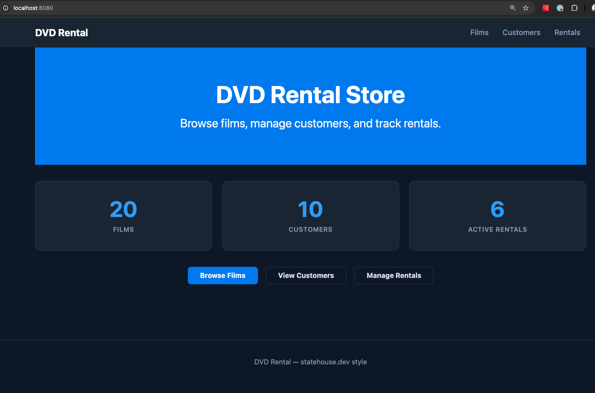

# DVD Rental — SWI-Prolog Web App (generated-app style)

A complete DVD rental management system built with SWI-Prolog. The app follows a **generated-app** layout: domain logic in Prolog, HTTP/HTML in the server, and durable data in PostgreSQL.



## Architecture

| Layer | Role |
|-------|------|
| **domain.pl** | Logic, rules, and “query layer” over facts (films, customers, rentals, rent/return) |
| **server.pl** | HTTP server, HTML rendering, routing |
| **db.pl** | Persistence: load/save facts between Prolog and PostgreSQL (via `psql`) |
| **PostgreSQL** | Durable tables: languages, categories, actors, films, film_actors, film_categories, customers, inventory, rentals |

Data is loaded from Postgres at startup via `db:db_load`; mutations (rent/return) are persisted with `db:db_persist_rental` and `db:db_persist_return`.

## Requirements

- [SWI-Prolog](https://www.swi-prolog.org/) 8.0+
- [PostgreSQL](https://www.postgresql.org/) (client + server for persistence)
- [Devbox](https://www.jetify.com/docs/devbox/installing-devbox) (recommended: pins Prolog and Postgres)

## Running with Devbox (recommended)

Devbox provides SWI-Prolog and PostgreSQL so all dependencies run locally.

### 1. One-time: initialize Postgres and the database

```bash
cd prolog-dev-rental
devbox shell
initdb                    # once: create PGDATA
devbox services up -b     # start PostgreSQL in background (or: devbox services up postgresql)
exit
devbox run init-db        # create DB 'dvdrental' and load schema + seed data
```

### 2. Start the app

```bash
devbox run start
```

The server listens on **http://localhost:8080/**.

To run with a shell (e.g. to run `swipl` or `psql`):

```bash
devbox shell
devbox services up -b     # if Postgres not already running
swipl server.pl           # or use the REPL
```

### Environment (optional)

The app reads PostgreSQL connection from the environment (defaults in parentheses):

- `PGHOST` (localhost; with Devbox Postgres plugin often `./.devbox/virtenv/postgresql`)
- `PGPORT` (5432)
- `PGUSER` (empty)
- `PGDATABASE` (dvdrental)

No need to set these if you use Devbox’s default Postgres setup.

## Running without Devbox

1. Install SWI-Prolog and PostgreSQL.
2. Create and initialize the database:

   ```bash
   createdb dvdrental
   psql -d dvdrental -f schema.sql
   ```

3. Start the server:

   ```bash
   swipl server.pl
   ```

Set `PGHOST`, `PGPORT`, `PGUSER`, `PGDATABASE` if your Postgres is not on localhost:5432 with database `dvdrental`.

## Project structure

```
domain.pl       Domain logic: dynamic facts, queries, rent/return commands
server.pl       Web layer: HTTP server, routing, HTML
db.pl           Persistence: db_load, db_persist_rental, db_persist_return (psql)
schema.sql      PostgreSQL schema and seed data
scripts/        init-db.sh — create DB and load schema (devbox run init-db)
static/         style.css
```

## Features

- Browse and search the film catalog
- Filter films by category
- Film detail pages with cast, availability, and rent form
- Customer directory with rental history
- Rent films (with availability checks) and return them
- Dashboard with live stats (films, customers, active rentals)

All data is stored in PostgreSQL; the app loads it at startup and persists new rentals and returns.
